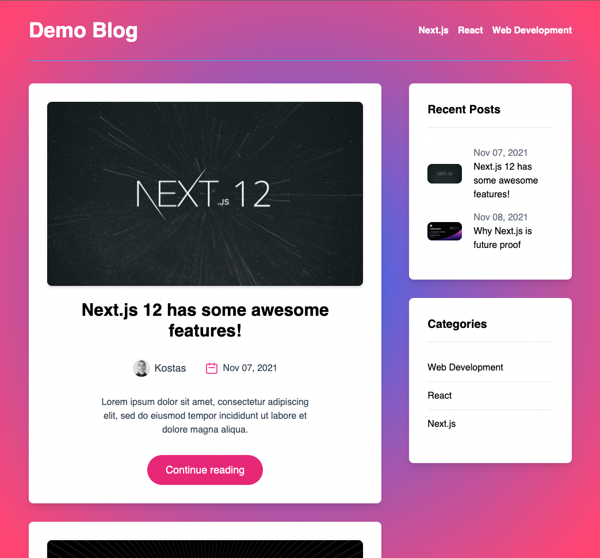

# Next.js + graphCMS + Tailwind CSS Demo Blog

## [View Deployed site](https://blog-with-nextjs-graphcms.vercel.app/)🥳

Thanks vercel for such a smooth dev experience!

## Description

A basic web blog using content management system [graphCMS](https://graphcms.com/)

### Functionality:

- Navigation by category (auto generated in header)
- Recent Posts widget
- Featured Posts widget
- Related Posts widget
- Comment form
- Comments (must be approved in graphCMS console)
